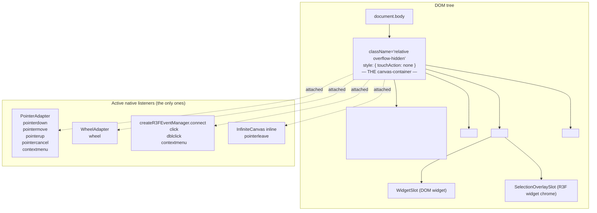
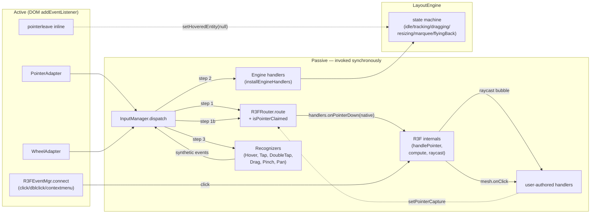
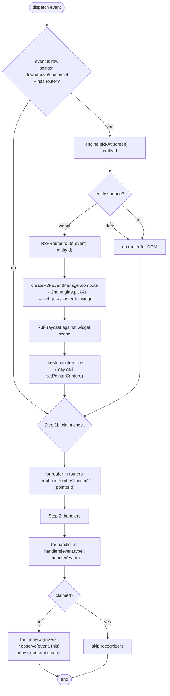
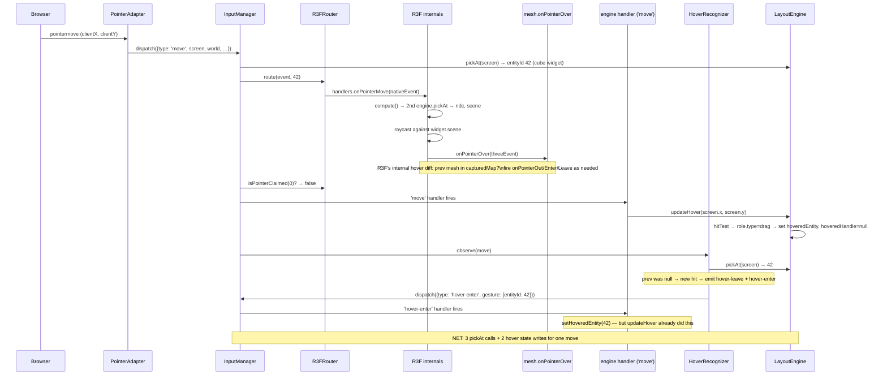
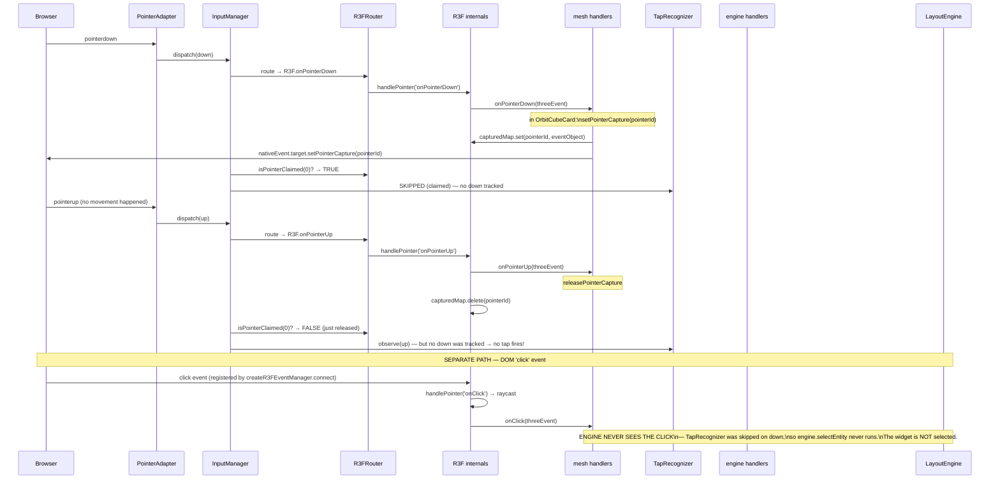
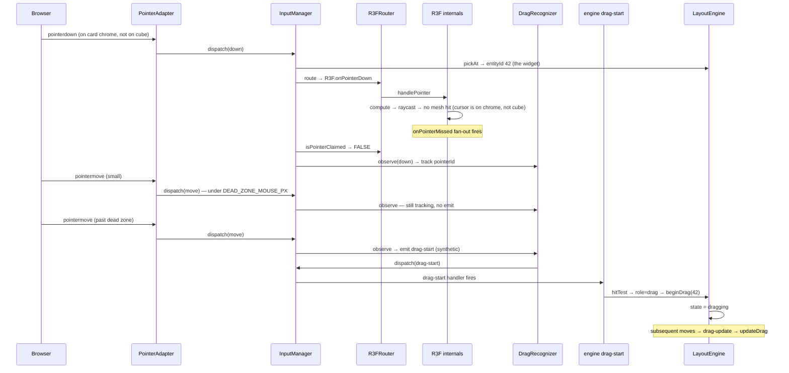
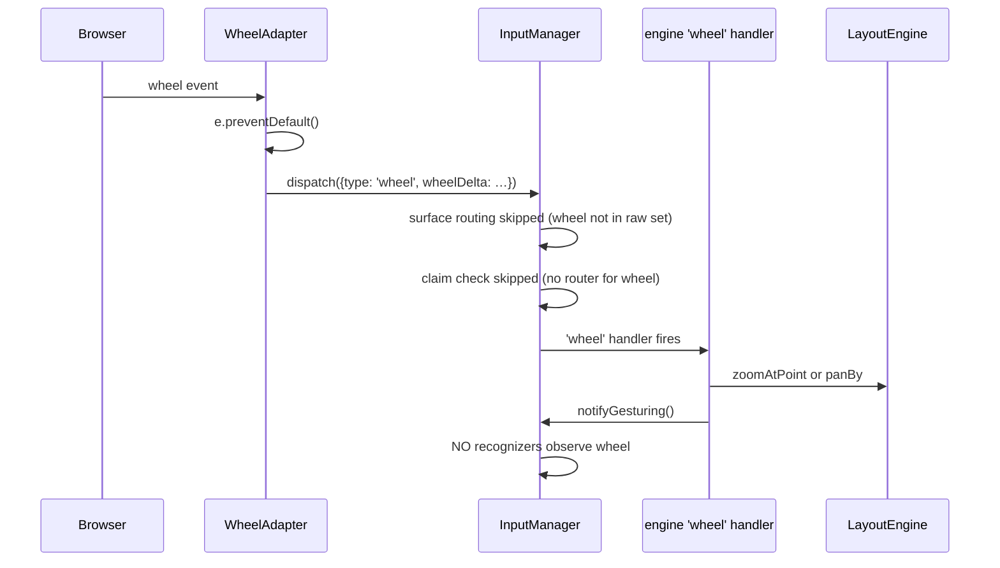
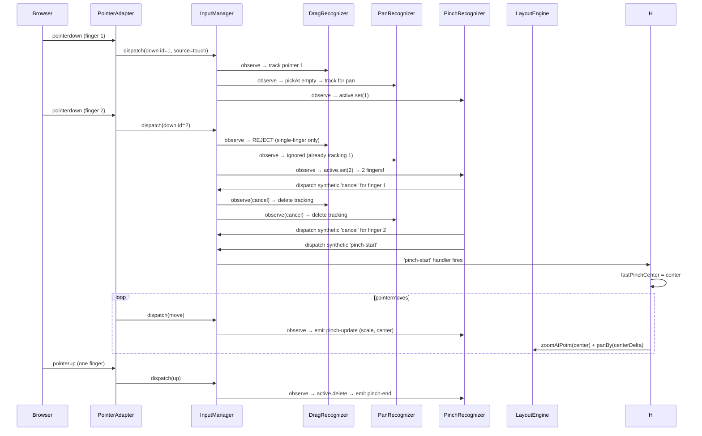
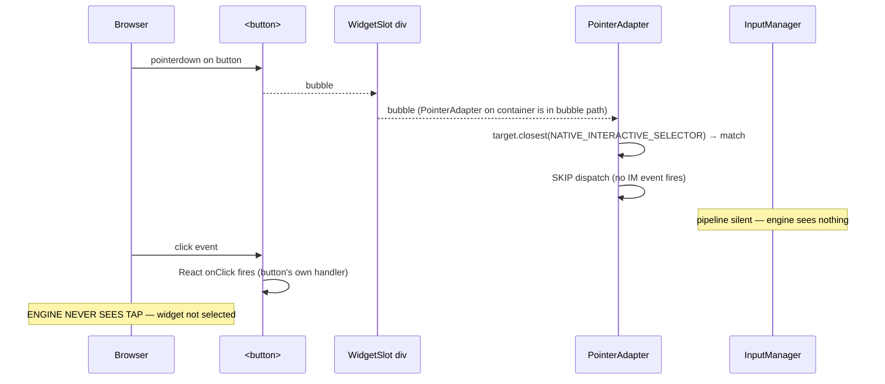
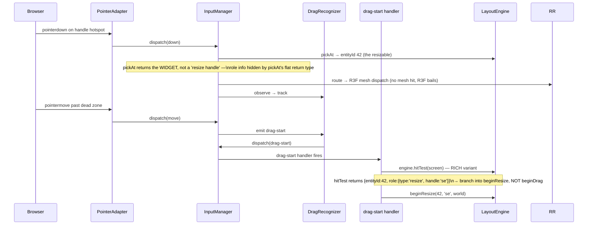

# RFC-008 Input Pipeline — Topology & Event Flow

A thorough map of every native source, every listener, every dispatch
step, and how a representative set of gestures actually flows through
the pipeline as it stands today (post phase 3d + browser-bug fixes).
Includes design smells at the bottom — read those first if you're
auditing.

---

## 1. DOM listener topology

Where the actual `addEventListener` calls live.



**Key facts:**

- Every native listener is on the **same** DOM element (the canvas-container `<div>`).
- The `<canvas>` itself has `pointerEvents: none` and **no listeners**.
- DOM widgets render inside `WidgetSlot` divs nested in the layer containers; their own React `onClick`/`onPointerDown` etc. fire via React's natural delegation when events bubble through.
- `touchAction: none` on the container disables browser-default touch scrolling/zooming so the browser synthesises pointer events from touch reliably.

---

## 2. Layer responsibilities



---

## 3. InputManager.dispatch lifecycle

The dispatch function runs in a fixed three-stage order. Both raw
events (from adapters) and synthetic events (re-dispatched by
recognizers) go through the same loop.



---

## 4. Scenario walkthroughs

### 4.1 Mouse hover over an R3F widget mesh

A single `pointermove` while the mouse is over a cube inside a webgl widget. No buttons pressed.



**Smells visible here:**

- **3 hit-tests per pointermove**: InputManager.pickAt + R3F.compute.pickAt + HoverRecognizer.pickAt. Cheap individually (RBush) but redundant.
- **Hover state is written twice**: once by `updateHover` (move handler), once by HoverRecognizer's hover-enter event. The second write is a no-op (same entity), but it's wasted work and an inconsistency in design.

### 4.2 Click (down→up no movement) on an R3F mesh

Two pointer events plus a click event — and **the click is on a separate native channel**.



**Smells visible here:**

- **Click never selects the widget when mesh captures.** The mesh's `setPointerCapture` made the InputManager skip TapRecognizer, so the synthetic `tap` engine handler (which runs `engine.selectEntity`) never fires. The DOM `click` only goes to R3F (via the connect-side listener), not to our pipeline. So clicking a mesh that captures: mesh logs, widget doesn't select. **The "default coexistence" promise breaks for capture+click.**
- **The click path is entirely separate from the InputManager pipeline.** R3F handles it, our pipeline doesn't. There's no `[InputManager]` log for clicks. They're a side channel.

### 4.3 Drag on an R3F mesh that calls setPointerCapture

The mesh wins exclusivity (correct outcome — what the user just verified).

```mermaid
sequenceDiagram
    participant Browser
    participant PA as PointerAdapter
    participant IM as InputManager
    participant RR as R3FRouter
    participant R3F as R3F internals
    participant Mesh as mesh handlers
    participant Drag as DragRecognizer
    participant Eng as LayoutEngine

    Browser->>PA: pointerdown
    PA->>IM: dispatch(down)
    IM->>RR: route → R3F.onPointerDown
    RR->>Mesh: onPointerDown
    Mesh->>R3F: capturedMap.set + DOM setPointerCapture
    IM->>RR: isPointerClaimed → TRUE
    Note over IM,Drag: recognizers SKIPPED for this down

    loop each pointermove
        Browser->>PA: pointermove (capture redirects target,\nbut event still bubbles to container)
        PA->>IM: dispatch(move)
        IM->>RR: route → R3F.onPointerMove
        RR->>Mesh: onPointerMove → cube rotates
        IM->>RR: isPointerClaimed → TRUE
        Note over IM,Drag: recognizers SKIPPED — no drag-start
    end

    Browser->>PA: pointerup
    PA->>IM: dispatch(up)
    IM->>RR: route → R3F.onPointerUp
    RR->>Mesh: onPointerUp → releasePointerCapture
    R3F->>R3F: capturedMap.delete
    IM->>RR: isPointerClaimed → FALSE
    IM->>Drag: observe(up) — no tracked down → no drag-end
    Note over Eng: engine state UNTOUCHED. Cube rotated;\nwidget didn't move; nothing to clean up.
```

**Smells visible here:**

- **Capture is detected by *probing R3F's internal state***. R3FRouter calls `manager.isPointerCaptured` which reads `store.getState().internal.capturedMap`. This is a private R3F field; we're depending on its shape for correctness. If R3F renames or refactors this, we silently break.
- **The claim is asymmetric — only R3FRouter implements it.** A DOM widget that wanted to claim a pointer (no analogue exists today, but a future scrolling-content widget might) would have no way to do so without a custom DOMRouter we haven't built.
- **PointerAdapter still sees every captured event.** Despite the spec's claim that capture "shields" PointerAdapter, captured events still bubble up to the container. The shielding is done by the claim check, not by capture. The mental model in the RFC is wrong about this.

### 4.4 Drag on the card chrome (around the cube), no mesh hit



### 4.5 Drag on empty canvas (marquee)

Same as 4.4 but pickAt returns null. R3FRouter never invoked. drag-start handler hits the empty branch → `clearSelection + beginMarquee`.

### 4.6 Wheel scroll for camera pan/zoom



**Smells visible here:**

- **Wheel events bypass R3F entirely.** R3F mesh `onWheel` handlers are never invoked. The RFC accepted this as out-of-scope but if a 3D widget wanted scroll-zoom internally, there's no path.
- **Wheel is single-purpose**: the whole pipeline (router/claim/recognizers) is bypassed. Wheel could just be a direct engine call. The dispatch ceremony is theatre for wheel.

### 4.7 Touch pinch (two-finger gesture on empty space)



**Smells visible here:**

- **Recognizers register state on events that other recognizers will then cancel.** PanRecognizer tracked finger 1 in step 3 of dispatch(down id=1). When finger 2 lands, PinchRecognizer dispatches a synthetic cancel which… tells PanRecognizer to undo state it shouldn't have set. Whole-pipeline overhead for state-that-might-be-rolled-back is fine functionally but smells like "always-do-then-maybe-undo" rather than "predict-then-do."
- **Recognizer order matters more than the doc admits.** If PinchRecognizer ran before DragRecognizer in observation order, the synthetic cancel would fire before DragRecognizer ever tracked the pointer — breaking the rollback. The current sequence works because of registration order in `InfiniteCanvas.tsx`.

### 4.8 DOM widget click (button inside a widget)



**Smells visible here:**

- **Native-interactive skip is silent.** The user clicks a button inside a DOM widget, the button does its thing — but the widget doesn't get selected. Same "click-doesn't-coexist" smell as 4.2 but for a different reason (here the skip is by selector match; in 4.2 it's by capture).
- **The skip is implemented as a hard-coded selector list** (`button, input, textarea, select, [contenteditable]`). Authors can't extend it without forking the adapter.

### 4.9 Resize handle drag



**Smells visible here:**

- **`pickAt` and `hitTest` are redundant.** They run the same hit-test internally (`hitTest()` private function in `interaction.ts`). `pickAt` flattens to entityId; `hitTest` returns the rich shape. Two methods on the public API for "the same thing minus role info."
- **drag-start handler runs `hitTest` even though InputManager already ran `pickAt` on the same screen point in step 1.** Two hit-tests per drag-start.

---

## 5. Architectural smells (honest list)

### 5.1 The pipeline has hidden side channels

The "single InputManager pipeline" promise is fiction. There are at
least **four parallel native-event paths** that drive engine /
widget behaviour:

| Path | Source | Reaches engine? | Reaches mesh? |
|---|---|---|---|
| PointerAdapter | pointerdown/move/up/cancel on container | ✓ | ✓ via R3FRouter |
| WheelAdapter | wheel on container | ✓ | ✗ |
| `createR3FEventManager.connect` | click/dblclick/contextmenu on container | ✗ | ✓ |
| Inline `pointerleave` listener | pointerleave on container | ✓ (setHoveredEntity null) | ✗ |

A click on an R3F mesh: only the third path fires for the click; the
first path fires for the down/up. They aren't joined anywhere.

**Cost:** clicking a mesh that captures doesn't select the widget.
Clicking a `<button>` inside a DOM widget doesn't select the widget.
The default-coexistence model the RFC promises only works when capture
isn't involved AND target isn't a native interactive.

### 5.2 The "claim" is R3F-specific and probes private state

`R3FRouter.isPointerClaimed` reads `store.getState().internal.capturedMap`
— a private R3F field. There's no parallel mechanism for DOM widgets,
no `WidgetSurfaceRouter`-side abstract claim, no API surface for an
author to claim a pointer except via the R3F-native
`setPointerCapture` channel.

If R3F renames / refactors `internal.capturedMap`, our claim silently
fails (cube starts dragging the widget again, no error).

### 5.3 `pickAt` runs 2–3 times per pointermove

For a single pointermove over a webgl widget:

1. `InputManager.dispatch` step 1 — `engine.pickAt(screen)` to choose router.
2. `createR3FEventManager.compute` — `engine.pickAt(screen)` again to set up raycaster.
3. `HoverRecognizer.observe('move')` — `manager.pickAt(screen)` for entity tracking.
4. `'move'` engine handler — `engine.updateHover(screen)` which runs the internal `hitTest` (a richer pickAt).

Spatial-index queries are O(log n + k) so it's not catastrophic, but
the dispatch loop does the same query four ways.

### 5.4 Hover state is written from three places

- `HoverRecognizer` → `'hover-enter'` engine handler → `engine.setHoveredEntity(entityId)` (no handle).
- `'move'` engine handler → `engine.updateHover(screenX, screenY)` (sets entity AND handle).
- Inline `pointerleave` → `engine.setHoveredEntity(null)`.

The first two race; the move handler always wins because it runs in
step 2 before recognizers in step 3, and it sets both fields. The
hover-enter path is dead weight — it only runs because the
recognizer was a useful abstraction in the spec, but in practice the
move handler does its job + handles. We kept it for "external
listeners" but no external listener uses it.

### 5.5 Recognizer order matters but is documented as "doesn't"

InputManager.ts comment says order is observation-only. But:

- DragRecognizer's single-finger guard rejects 2nd `down` while a
  pointer is tracked. PinchRecognizer dispatches synthetic `cancel`
  on 2nd `down` to retire the first.
- Whether DragRecognizer skips the 2nd `down` because it's already
  tracking, vs. PinchRecognizer cancels the first then DragRecognizer
  tracks the 2nd: depends on registration order.
- TapRecognizer cancels its pending tap on `drag-start` / `pinch-start`
  it observes. If a recognizer that emits those runs before TapRecognizer
  observes, the order of synthetic dispatches matters.

The RFC says recognizers are independent. The implementation has
implicit ordering dependencies.

### 5.6 The `route` step queries pickAt redundantly with compute

`InputManager.dispatch` does `engine.pickAt(screen)` to find the entity
+ surface, picks the right router, calls `route(event, entityId)`. The
router (R3FRouter) hands the event to R3F which calls `compute(event)`,
which does its own `engine.pickAt(screen)` to set up the raycaster.

Architecturally we could pass `entityId` through to compute. The
RFC-006 design predates having that info upstream.

### 5.7 The "default coexistence" promise has more failure modes than successes

| Scenario | Coexistence works? |
|---|---|
| Hover on R3F mesh | ✓ both fire |
| Click on R3F mesh (no capture) | ✓ both fire |
| Click on R3F mesh (capture) | ✗ engine selection skipped |
| Click on DOM `<button>` | ✗ engine selection skipped |
| Drag on R3F mesh (no capture) | ✓ both fire (but dragging the widget along with rotating mesh is usually wrong UX) |
| Drag on R3F mesh (capture) | ✓ exclusive — widget stays put |
| Drag on R3F card chrome | ✓ widget drags, no mesh interaction |
| Drag on DOM widget body | ✓ widget drags, content stays |
| Wheel on R3F widget | ✗ mesh `onWheel` never fires |

So 3 of the 9 scenarios above either silently break coexistence or
just don't work. The RFC's main selling point is leakier than advertised.

### 5.8 The InputEvent union is a sloppy shape

`InputEvent` has `wheelDelta?` defined-on-wheel, `gesture?` defined-on-
synthetics, `delta?` defined-on-move, `button?` defined-on-down/up. A
discriminated union by `type` would push these to type-level
guarantees. As-is, every consumer does runtime checks (`if (event.gesture)`)
and handler bodies cast (`as Extract<GestureDetail, …>`).

### 5.9 The pipeline loses all type information about what handler matches what event

`manager.on('drag-start', handler)` registers `handler: (event: InputEvent) => void`.
The handler doesn't know it'll only see drag-start events; it must
cast `event.gesture as Extract<…>` to extract typed payload.

A typed `manager.on<T extends InputEventType>(type: T, handler: (event: InputEventOf<T>) => void)`
would push this to compile time.

---

## 6. The bigger question

The RFC was written assuming **DOM `setPointerCapture` shields ancestor listeners**.
That assumption is wrong (per W3C Pointer Events spec, captured events
still flow capture/target/bubble through the entire ancestor chain).
Once that assumption fails, every other architectural choice the RFC
made on top of it (the no-op connect, the "PointerAdapter is the only
listener," the "use platform primitives for ownership") loses its
load-bearing rationale.

The current code is held together by **the claim probe** added in
phase 3d — which works but reaches into R3F's internals. It's a
pragmatic fix that lets the system ship; it isn't an architecture.

A cleaner redesign would model the pipeline as **a single dispatcher
with explicit ownership semantics** at the protocol level, not
discovered post-hoc by probing private state. Likely shape:

- Adapters dispatch raw events.
- A **dispatch frame** is mutable: handlers/recognizers/widget
  surfaces can flag "I'm taking this gesture exclusively" and
  subsequent events for that pointerId route ONLY to the claimant
  until release.
- DOM `setPointerCapture` becomes a hint to R3F's internal
  raycast precedence (its actual usefulness), not the load-bearing
  ownership mechanism.
- Click events flow through the same dispatcher as pointer events
  (custom adapter wraps DOM `click` into an InputEvent type) so
  coexistence applies uniformly.

That's roughly what `event.consume()` would have looked like — RFC
Decision 1 rejected it in favour of "use platform primitives." The
platform primitives don't actually do what the RFC thought.
