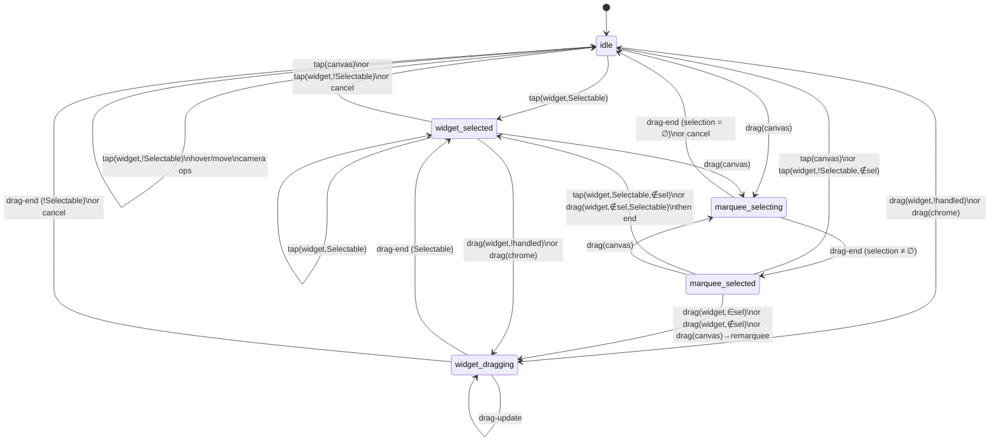

# RFC-009: Two-Layer Input Pipeline + ECS State Machine

- **Status**: Draft v2.1
- **Author**: James Yong
- **Date**: 2026-05-01
- **Area**: Interaction / Input / Engine API / ECS Components & Resources / R3F Layer / DOM Widget Layer
- **Related**: RFC-001 (ECS Hitbox — `pickAt`), RFC-005 (engine-rendered resize handles), RFC-008 (Input Manager — adapters/recognizers/router), `docs/diagrams/input-pipeline.md` (smell list 5.1–5.9)
- **Supersedes**: The runtime pipeline introduced by RFC-008 — `InputManager`, the recognizer registry (`HoverRecognizer`, `TapRecognizer`, `DoubleTapRecognizer`, `DragRecognizer`, `PinchRecognizer`, `PanRecognizer`), `installEngineHandlers`, `R3FRouter`'s `internal.capturedMap` probe, and the engine's `pickAt`/`hitTest` API split. Adapters survive but are repurposed as raw-event sources only.

---

## Summary

RFC-008 v6 unified the four native channels into one dispatcher (smell 5.1). What remains is the bigger problem: the post-dispatch pipeline has no top-level coordination. Six independent recognizers each maintain per-pointer state, observe events in parallel, and resolve conflicts through synthetic-event choreography. The engine has its own state machine that reacts to recognizer output. Hit-tests run 3–4 times per pointermove because no module owns the answer. Hover state has been written from up to three places at different times in different code revisions.

RFC-009 redesigns the post-dispatch pipeline around two ideas:

1. **Two-layer input pipeline.** A bottom layer (`RawInputPipeline`) normalizes platform events into a typed `RawInputEvent` stream. An upper layer (`GesturePipeline`) consumes that stream and emits abstract gestures (`hover`, `pan`, `pinch`, `tap`, `double-tap`, `drag`, `context-menu`). Every gesture event is enriched with `surface` and `surfaceHandled` *once* before any consumer sees it. Adapters know nothing about widgets; gestures know nothing about platform events.

2. **ECS state machine via the state pattern.** Five top-level states (`idle`, `marquee-selecting`, `marquee-selected`, `widget-selected`, `widget-dragging`) each become a system in the ECS. Only the system matching the current state runs in any tick. State systems consume gesture events and may transition state by writing a resource. Camera operations (pan/pinch on canvas, wheel) live in a separate state-independent system because they apply in every state.

The gesture pipeline replaces every recognizer file. The state systems replace `installEngineHandlers`. The R3F `internal.capturedMap` probe is replaced by automatic detection: a slot-equality test for DOM widgets and a raycast-result test for R3F widgets — widget authors write plain React/R3F with no framework hooks or claim-API calls. The result: one hit-test per gesture event, one hover writer, no recognizer-ordering footguns, no R3F private-state probes.

Net delta: roughly **−1700 LOC, +900 LOC**. Behavioural parity with v6 plus the corrections enumerated in §13.

---

## Motivation

### Smells addressed

| RFC-008 smell (`docs/diagrams/input-pipeline.md` §5) | Root cause | RFC-009 resolution |
|---|---|---|
| 5.1 Four parallel native channels | (already fixed in v6) | — |
| 5.2 R3F-only claim probes private state | Capture detected post-hoc | Automatic: slot-equality test (DOM) / raycast-result test (R3F); no widget-side framework calls |
| 5.3 `pickAt` runs 3–4× per pointermove | Each layer hit-tests independently | Single hit-test in the enrichment step; gesture context freezes hit at gesture-start |
| 5.4 Hover state written from 3 places | Move handler + recognizer + pointerleave race | One writer: the `idle` state system on `hover` events |
| 5.5 Recognizer ordering matters but is undocumented | Six independent observers with implicit choreography | One coherent `GesturePipeline` module; no recognizer registry |
| 5.6 `pickAt` and `hitTest` are the same function with two return shapes | Historical | Single `engine.hit(): HitResult \| null` |
| 5.7 Default coexistence has more failure modes than successes | Click side-channel + asymmetric capture | (5.1 fixed in v6); `surfaceHandled` makes coexistence first-class |
| 5.8 `InputEvent` is a loose optional bag | Not discriminated | `RawInputEvent` and `GestureEvent` are discriminated unions on `kind` |
| 5.9 `manager.on(type, handler)` loses type narrowing | Generic handler signature | Typed `pipeline.on<K>(kind, handler)` returns `GestureEventOf<K>` |

### Other wins

- **State systems read like English.** A new contributor can open `widget-selected.ts` and see every transition in the file without grepping six other files.
- **Adding a state = adding a system.** No central transition table to edit; the ECS scheduler picks the running state by resource.
- **Camera always responsive.** Pan/pinch/wheel work in every state because they're a separate system, not gated by FSM transitions.
- **Two distinct meanings of "the user is doing X" stop conflating.** Today's engine `inputState.mode` mixes "drag in flight" with "selection chrome should render" with "fly-back animation running." Each becomes a separate explicit concept.

### What this RFC is *not*

- Not a rewrite of the engine's effect API. `engine.beginDrag` / `engine.updateMarquee` / `engine.beginResize` etc. stay. Their *callers* move from `installEngineHandlers` callbacks to state-system transitions.
- Not multi-pointer simultaneous independent gestures. Pinch is a multi-pointer gesture with one shared center; "stylus on widget A while mouse drags widget B" is not supported.
- Not action-mapping (keyboard shortcuts, command palette). Future RFC.
- Not focus management. The current canvas-focus model survives unchanged.
- Not a new author-facing API for widgets. Widgets keep using React/R3F handlers as today; the framework infers ownership from event target / raycast result, not from any claim API.

---

## Architecture overview

```
┌────────────────────────────────────────────────────────────┐
│ Layer 1 — RawInputPipeline                                 │
│   PointerAdapter, WheelAdapter, ClickAdapter               │
│   widget-detection (R3F dispatch + DOM target check)        │
│   per-pointer tracker: { handled, downTarget, ... }         │
│   emits: RawInputEvent (no native ref, no handled flag)     │
└────────────────────────────────────────────────────────────┘
                          ↓
┌────────────────────────────────────────────────────────────┐
│ Layer 2 — GesturePipeline                                  │
│   consumes RawInputEvent, reads tracker for handled flag    │
│   emits GestureEvent                                        │
│   gestures: hover, pan, pinch, tap, double-tap, drag,       │
│             context-menu                                    │
│   wheel raw events are mapped to pan / pinch (no separate   │
│   WheelGesture in the union)                                │
└────────────────────────────────────────────────────────────┘
                          ↓
┌────────────────────────────────────────────────────────────┐
│ Hit-test enrichment (pure)                                  │
│   one engine.hit() call per gesture event                   │
│   enriches with: surface, surfaceHandled (from tracker), hit│
└────────────────────────────────────────────────────────────┘
                          ↓
┌────────────────────────────────────────────────────────────┐
│ Layer 3 — State systems (ECS, only the active one runs)     │
│   idleSystem, marqueeSelectingSystem, marqueeSelectedSystem,│
│   widgetSelectedSystem, widgetDraggingSystem                │
│   shared helpers: applyHoverDefaults, applyCameraDefaults   │
└────────────────────────────────────────────────────────────┘
                          ↓
                  engine.* effects
                  (beginDrag, panBy, zoomAtPoint, ...)
```

Layer-isolation rule: **native DOM events never escape Layer 1.** Layer 1 owns the native event end-to-end (R3F dispatch fires inside Layer 1; DOM target inspection happens inside Layer 1). It exposes a per-pointer tracker (`{ handled, downTarget, ... }`) that Layer 2 reads to populate `surfaceHandled` on emitted gestures. Layer 2 onward is platform-agnostic — gestures don't carry `native`, `enrich()` is pure, and state systems work in terms of intent.

### File layout

```
src/input/
  raw/                              ← Layer 1
    PointerAdapter.ts                normalize pointer events
    WheelAdapter.ts                  normalize wheel events
    ClickAdapter.ts                  normalize click/dblclick/contextmenu
    widget-tracker.ts                R3F + DOM widget-handled detection per pointer
    types.ts                         RawInputEvent discriminated union

  gesture/                          ← Layer 2
    GesturePipeline.ts               single coherent recognizer module
    enrich.ts                        hit-test enrichment (pure)
    types.ts                         GestureEvent discriminated union

  index.ts                           public API: createInputPipeline()

src/ecs/
  resources.ts                      + InputStateResource, PointerStateResource,
                                      HoveredResource
  systems/
    state/                          ← Layer 3
      idle.ts
      marquee-selecting.ts
      marquee-selected.ts
      widget-selected.ts
      widget-dragging.ts
      scheduler.ts                  picks the active state system per tick
      shared/
        hover-defaults.ts            applyHoverDefaults(world, gestureEvent)
        camera-defaults.ts           applyCameraDefaults(world, gestureEvent)
    cursor.ts                       reads HoveredResource + InputStateResource → CursorResource
```

The `src/react/input/` directory created by RFC-008 is fully replaced. Adapters move to `src/input/raw/` and lose their tight coupling to `InputManager`.

---

## Layer 1 — RawInputPipeline

A thin, surface-agnostic layer. Job: turn DOM events into a typed, normalized stream. Nothing else.

### Type

```ts
export type RawInputEvent =
  | RawDown
  | RawMove
  | RawUp
  | RawCancel
  | RawLeave
  | RawWheel
  | RawClick
  | RawDblClick
  | RawContextMenu;

interface RawCommon {
  readonly screen: Readonly<Point>;        // canvas-container relative px
  readonly world:  Readonly<Point>;        // post-camera world coords
  readonly modifiers: Readonly<Modifiers>; // shift/ctrl/alt/meta — sourced directly
                                           // from PointerEvent / MouseEvent / WheelEvent
  readonly timestamp: number;
  // RawInputEvent intentionally does NOT carry the native DOM Event.
  // The native event is owned end-to-end by Layer 1 (adapters): R3F
  // dispatch fires inside the adapter's onPointerDown handler, the
  // DOM target check runs inside the adapter, and the result is
  // recorded into the per-pointer tracker. By the time a RawInputEvent
  // is forwarded to Layer 2, all native-shaped concerns are resolved.
  // Gestures emitted by Layer 2 are platform-agnostic.
}

interface RawPointerCommon extends RawCommon {
  readonly pointerId: number;
  readonly primary: boolean;
  readonly source: 'mouse' | 'pen' | 'touch';
}

export interface RawDown        extends RawPointerCommon { kind: 'down'; button: Button; }
export interface RawMove        extends RawPointerCommon { kind: 'move'; delta: Readonly<Point>; }
export interface RawUp          extends RawPointerCommon { kind: 'up';   button: Button; }
export interface RawCancel      extends RawPointerCommon { kind: 'cancel'; }
export interface RawLeave       extends RawPointerCommon { kind: 'leave'; }
export interface RawWheel       extends RawCommon       { kind: 'wheel'; delta: { dx: number; dy: number }; pinch: boolean; }
export interface RawClick       extends RawCommon       { kind: 'click';       button: Button; pointerId: number; }
export interface RawDblClick    extends RawCommon       { kind: 'dblclick';    pointerId: number; }
export interface RawContextMenu extends RawCommon       { kind: 'contextmenu'; pointerId: number; }
```

Discriminated by `kind`. `screen`/`world`/`modifiers` are present on every variant; per-kind fields are type-safe.

Keyboard events are intentionally not modeled in v2 — modifier state (shift/ctrl/alt/meta) arrives natively on every pointer / wheel / click event. Keyboard-driven actions (delete key, undo, escape, etc.) are deferred to a future RFC. No `KeyAdapter` is needed to make the input pipeline work.

### Adapters

Three adapters, each owns the listeners for its DOM event family. They all mount on the canvas-container `<div>`. They share a `WidgetTracker` (defined below) — adapters write to it, the GesturePipeline reads from it.

```ts
interface RawAdapter {
  attach(
    container: HTMLElement,
    engine: LayoutEngine,
    tracker: WidgetTracker,
    sink: (e: RawInputEvent) => void,
  ): () => void;
}

class PointerAdapter implements RawAdapter { /* down/move/up/cancel/leave */ }
class WheelAdapter   implements RawAdapter { /* wheel (passive: false; preventDefault) */ }
class ClickAdapter   implements RawAdapter { /* click/dblclick/contextmenu */ }
```

Adapters do not emit `RawInputEvent` blindly — they first run **widget-handled detection** for each native event (because the native event is the only thing that knows the actual DOM target / R3F raycast result). The result is recorded in the tracker; only then is the `RawInputEvent` emitted.

### Native-interactive skip

The `NATIVE_INTERACTIVE_SELECTOR` skip survives. It applies at the adapter layer (the lowest possible point), before the raw event is emitted. A `pointerdown` on a `<button>` inside a DOM widget is suppressed at `PointerAdapter`, never reaches the GesturePipeline. Same rule for `click`/`dblclick` in `ClickAdapter`. `contextmenu` always fires `preventDefault` (canvas isn't a place for the browser context menu) but skips dispatch on native interactive.

### Widget-handled detection (Layer 1)

`WidgetTracker` records, per pointer, whether the active gesture is "owned by a widget." The result is **snapshotted at `pointerdown` time** and propagated for the lifetime of that pointer's gesture (via `tracker.isHandled(pointerId)`). For events without a tracked pointer (hover, wheel), the tracker computes inline from the event's DOM target.

```ts
interface WidgetTracker {
  /** Called by adapters during the native event. Records ownership. */
  recordDown(pointerId: number, native: PointerEvent, hit: Hit | null): void;
  recordUp(pointerId: number): void;
  recordCancel(pointerId: number): void;

  /** Read by GesturePipeline at gesture-emit time. */
  isHandled(pointerId: number): boolean;

  /** Inline check for events without an active pointer (hover, wheel). */
  detectInline(native: PointerEvent | MouseEvent | WheelEvent, hit: Hit | null): boolean;
}
```

Detection rules:

```ts
function detect(native: Event, hit: Hit | null): boolean {
  if (!hit) return false;                          // no entity → no widget owner
  if (hit.role.role.type === 'resize') return false;  // chrome is framework-owned

  const widget = engine.get(hit.entityId, Widget);

  if (widget?.surface === 'webgl') {
    // R3F: widget owns iff raycast (run during this same native event)
    // intersected a mesh inside the widget's scene.
    return r3fRaycastHitMesh(native, hit.entityId);
  }

  // DOM: widget owns iff the event target is a descendant of the slot
  // (and not a data-passive opt-out).
  const slot = slotRefs.get(hit.entityId);
  const target = native.target as HTMLElement | null;
  if (!slot || !target) return false;
  if (target === slot) return false;               // wrapper hit; widget rendered nothing here
  if (target.closest('[data-passive]') !== null) return false;
  return true;
}
```

`recordDown` calls `detect` and stores the result. The PointerAdapter calls `recordDown` from within its `pointerdown` listener, *before* forwarding the `RawInputEvent` — so by the time the GesturePipeline sees the down, the tracker is populated. R3F's widget dispatch (the call into `manager.handlers.onPointerDown(native)`) also fires within the adapter's `pointerdown` listener, before `recordDown` returns, so the raycast result is observable. **All native-event handling for one pointer event happens synchronously inside Layer 1.**

For non-pointer-tracked events:

- **Hover** (raw `move` with no down): `tracker.detectInline(native, hit)` is called by the adapter; the result rides on the emitted hover gesture (without a `pointerId` snapshot).
- **Wheel**: same — `detectInline` from the wheel event's target. Wheel never enters R3F dispatch (R3F wheel handling is out of scope, see decision §15.D5).
- **Click / dblclick / contextmenu**: these arrive *after* the corresponding `pointerdown`/`pointerup` cycle. The tracker still has the up-time entry (`recordUp` doesn't clear; only `recordCancel` does). The click adapter looks up the pointerId; if found, reads `isHandled`, otherwise falls back to `detectInline`.

### Why this preserves layer isolation

Native events never leave Layer 1. Layer 2 reads only `tracker.isHandled(pointerId)` which returns a `boolean`. The R3F dispatch that determines mesh-hit ownership runs synchronously inside Layer 1's adapter, populates the tracker, and discards the native event reference. The GesturePipeline's `consume` is platform-agnostic; the enrichment step is pure (`engine.hit()` + `tracker` reads, no native event in scope).

---

## Layer 2 — GesturePipeline

One stateful module. Consumes `RawInputEvent`, emits `GestureEvent`. Replaces every recognizer file.

### Type

```ts
export type GestureEvent =
  | HoverGesture
  | PanGesture
  | PinchGesture
  | DragGesture
  | TapGesture
  | DoubleTapGesture
  | ContextMenuGesture;

interface GestureCommon {
  readonly screen: Readonly<Point>;
  readonly world:  Readonly<Point>;
  readonly modifiers: Readonly<Modifiers>;
  readonly timestamp: number;

  /** Populated by the enrichment step before any consumer sees it. */
  readonly surface: Surface;          // 'canvas' | 'widget' | 'chrome'
  readonly surfaceHandled: boolean;   // read from WidgetTracker (Layer 1):
                                      // - DOM widgets: target is a descendant of the slot, not data-passive
                                      // - R3F widgets: raycast at down-time hit a mesh in the widget's scene
                                      // Snapshotted at gesture-start (tracked pointers) or computed inline
                                      // (hover / wheel — events without a tracked down).
  readonly hit: Hit | null;           // entityId + role; frozen at gesture-start, repeated on update/end
}

export interface HoverGesture        extends GestureCommon { kind: 'hover'; phase: 'enter' | 'move' | 'leave'; pointerId: number; }
export interface DragGesture         extends GestureCommon { kind: 'drag'; phase: 'start' | 'update' | 'end' | 'cancel'; pointerId: number; delta: Point; total: Point; button: Button; }
export interface PanGesture          extends GestureCommon { kind: 'pan'; phase: 'start' | 'update' | 'end'; pointerIds: readonly number[]; center: Point; delta: Point; }
export interface PinchGesture        extends GestureCommon { kind: 'pinch'; phase: 'start' | 'update' | 'end'; pointerIds: readonly [number, number]; center: Point; scale: number; }
export interface TapGesture          extends GestureCommon { kind: 'tap'; pointerId: number; button: Button; }
export interface DoubleTapGesture    extends GestureCommon { kind: 'double-tap'; pointerId: number; }
export interface ContextMenuGesture  extends GestureCommon { kind: 'context-menu'; pointerId: number; }
```

**Wheel is not a `GestureEvent` kind**, but wheel raw events *do* drive gestures: GesturePipeline maps them to `pan` or `pinch` based on the wheel's `pinch` flag (set when ctrl/meta is held — trackpad pinch). State systems never see "wheel" as a gesture kind; they see synthesized `pan` (with `phase: 'update'`, no start/end) or `pinch`. This keeps the gesture vocabulary intent-based: wheel is an *input source*, not a *user intent*.

### Internal state

```ts
class GesturePipeline {
  // per-pointer down position + time, used for tap/dead-zone/long-press
  private readonly tracking = new Map<number, {
    downAt: Point;
    downTime: number;
    button: Button;
    // `handled` lives on Layer 1's WidgetTracker — read via tracker.isHandled(pointerId)
    // when emitting any gesture for this pointer.
  }>();

  // Set of pointers currently producing 'drag' events.
  private readonly dragging = new Set<number>();

  // Two-pointer gesture (pinch/pan) bookkeeping.
  private pinch: { ptrs: [number, number]; lastCenter: Point; lastDist: number } | null = null;

  // Last hovered entity, per pointer.
  private readonly lastHover = new Map<number, EntityId | null>();

  // Last tap (for double-tap detection).
  private lastTap: { time: number; screen: Point; pointerId: number } | null = null;

  consume(raw: RawInputEvent): readonly GestureEvent[] { /* … */ }
}
```

### Recognition rules (informal)

- **`down`** → start tracking pointer; if it's the second active pointer for `dragging`/`tracking`, transition to pinch (cancel any in-flight drag for the first pointer with `phase: 'cancel'`).
- **`move`** while tracking, past dead-zone → emit `drag` with `phase: 'start'` if first move, else `'update'`. Single-pointer.
- **`move`** while two pointers tracked → emit `pinch` (always — distance change drives `scale`) and `pan` (center delta drives camera pan in case of two-finger pan; state systems handle both via `applyCameraDefaults`).
- **`move`** with no down → emit `hover` with `phase: 'move'`. Hover-enter/leave fired on entity transition.
- **`up`** within `TAP_WINDOW_MS` and dead-zone → emit `tap`. If a second tap arrives within `DOUBLE_TAP_WINDOW_MS` and `DOUBLE_TAP_DEAD_ZONE_PX`, emit `double-tap` *instead of* the second `tap` (FSM never sees two consecutive `tap`s in this case).
- **`up`** during drag → emit `drag` with `phase: 'end'`.
- **`cancel`** → emit `drag` with `phase: 'cancel'` for any in-flight drag; **always clear per-pointer tracking** (`tracking`, `dragging`, hover state) for that pointer regardless of whether the FSM consumed the gesture event.
- **`leave`** → emit `hover` with `phase: 'leave'` for the pointer.
- **`up`** for a pointer not in `dragging` (post-tap or never-moved): clear `tracking` entry. Per-pointer cleanup is unconditional on `up`/`cancel` — if the FSM rejects a gesture event because we're in a non-active state for that pointer, no leak: the GesturePipeline cleans itself up when the pointer eventually leaves the system.
- **`contextmenu`** → emit `context-menu`.
- **`wheel`** → emit `pan` (`pinch=false`) or `pinch` (`pinch=true`) with `phase: 'update'` only.

`DoubleTapRecognizer`, `LongPressRecognizer`, etc. are **methods on `GesturePipeline`**, not separate registered observers. Pairwise relationships (drag-cancels-tap, pinch-cancels-drag) are explicit in the `consume` function, not implicit through synthetic-event choreography.

### Detecting widget-handled events

Detection happens entirely in **Layer 1** (`WidgetTracker`) — see §4. Widget authors write plain React / R3F handlers; the framework infers ownership from the event target (DOM) or raycast result (R3F) at gesture-start time and propagates it through the gesture's lifetime via `tracker.isHandled(pointerId)`.

The GesturePipeline reads `tracker.isHandled(raw.pointerId)` when constructing a gesture event for a tracked pointer; the enrichment step writes the result onto `surfaceHandled`. For untracked events (hover, wheel), the tracker computes detection inline from the current event's target.

### Author-facing design rule

The detection mechanism (slot-equality for DOM, raycast-result for R3F) is fully described in §4. From a widget author's perspective there is one rule:

> **If your widget renders an element inside the slot (DOM) or a mesh inside its scene (R3F), that element owns interaction at its position.** A click on it doesn't fall through to the canvas. A drag on it doesn't move the widget.
>
> If you render something *passive* that should be transparent to canvas-level gestures (a decorative ``, a label that shouldn't block dragging the card around it), opt out with one of:
>
> - `` — framework treats this element as if it weren't rendered, for hit-detection purposes
> - `` — same effect, plus the browser doesn't dispatch any pointer events to it at all
>
> Choose `pointer-events: none` if you also want the element to be invisible to widget-internal handlers (clicks go to whatever is behind it). Choose `data-passive` if you want widget-internal handlers to still fire (e.g. an image with a hover effect) but you also want canvas-level gestures (drag the card) to work *over* it.

Widget authors write plain React / R3F handlers. **No `setPointerCapture` call. No framework hook. No `event.handle()` method.** The current `OrbitCubeCard.setPointerCapture(...)` call deletes; the mesh's `onPointerDown` handler does its orbit-state setup and that's all.

```tsx
// DOM widget — plain React
function MyShape() {
  return (
    <div onPointerDown={(e) => /* widget logic */}>
      <button onClick={...}>Action</button>
                  {/* canvas can drag over this */}
    </div>
  );
}

// R3F widget — plain R3F (post-RFC-009)
function OrbitCubeScene({ data }) {
  return (
    <mesh onPointerDown={(e) => {
      e.stopPropagation();
      // ... orbit-state setup. No setPointerCapture; framework sees the
      // raycast hit this mesh and sets surfaceHandled=true automatically.
    }}>
      ...
    </mesh>
  );
}
```

### Future: dev-mode warning

In development builds, when a gesture is marked `surfaceHandled = true` because a passive-looking element (an ``, `<svg>`, `<span>` with no event handlers) was the target, the framework can emit a console warning:

> "Element `` inside widget `card-3` blocks canvas-level interaction. Add `data-passive` or `pointer-events: none` if this is decorative content."

Heuristic and noisy. Tracked as a v3 feature, not v2.

### DOM `setPointerCapture` is a consequence, not the source of truth

When the GesturePipeline transitions a pointer into a tracked-drag state (regardless of `surfaceHandled`), Layer 1 issues `setPointerCapture(pointerId)` on the canvas container so the pointer stream survives the cursor leaving the original target's bounds. Capture is a *delivery mechanism* (keeps the OS sending events), not a claim mechanism (which is the WidgetTracker's job).

---

## Hit-test enrichment

A **pure function** that runs once per gesture event between `GesturePipeline.consume()` and any consumer. It receives only the gesture event, the engine, and the tracker — no native DOM event. All native-event-shaped concerns were resolved in Layer 1.

```ts
function enrich(
  raw: GestureEvent,
  engine: LayoutEngine,
  tracker: WidgetTracker,
): GestureEventEnriched {
  // For continuing gestures (drag-update, pinch-update, etc.), reuse the
  // hit + surfaceHandled frozen at gesture-start. The pipeline carries
  // `_startSnapshot` internally per pointerId.
  if (raw.kind === 'drag'  && raw.phase !== 'start') return frozenSnapshot(raw);
  if (raw.kind === 'pinch' && raw.phase !== 'start') return frozenSnapshot(raw);
  if (raw.kind === 'pan'   && raw.phase !== 'start') return frozenSnapshot(raw);

  // First-frame events (drag-start, hover, tap, dblclick, contextmenu, etc.)
  // run engine.hit() once.
  const hit = engine.hit(raw.screen.x, raw.screen.y);
  const surface: Surface =
    hit === null                              ? 'canvas' :
    hit.role.role.type === 'resize'           ? 'chrome' :
                                                'widget';

  // surfaceHandled is read from the tracker (populated by Layer 1):
  //  - tracked pointers (drag-start, tap, dblclick, contextmenu): isHandled
  //    returns the value snapshotted at pointerdown time.
  //  - untracked events (hover): tracker computes inline from the event
  //    target, which the adapter passed through during emission.
  const surfaceHandled =
    surface !== 'widget' ? false :
    'pointerId' in raw   ? tracker.isHandled(raw.pointerId) :
                           false;  // wheel-derived pan/pinch — see L1 above

  return { ...raw, surface, surfaceHandled, hit };
}
```

The three surfaces:

- **`canvas`** — `hit === null`. Empty canvas area, no widget, no chrome. `surfaceHandled` is always `false`.
- **`widget`** — `hit.entityId !== null && hit.role.role.type !== 'resize'`. Pointer is over a widget. `surfaceHandled` is computed via the slot-equality test (DOM widgets) or raycast-result test (R3F widgets), per §5. State systems read this to decide whether engine reacts.
- **`chrome`** — `hit.role.role.type === 'resize'`. Pointer is over an engine-drawn resize hotspot. Always framework-owned; `surfaceHandled` is always `false`.

The `Widget.surface` component (`'dom' | 'webgl' | 'webview'`) is **not** the same as the gesture event's `surface` enum. The component records *how the widget renders*; the gesture event's `surface` records *what kind of thing the user is pointing at* (canvas / widget body / engine chrome). State systems read only the gesture-event `surface`. Delivery layers (R3F dispatch routing) read the component to know which dispatch path to use.

### Hit-freezing across multi-event gestures

A drag from start to end always reports `surface = X` at start and the same `surface` at update/end. The hit is *frozen at gesture-start*. This is what makes "click-and-drag a widget across the canvas" work cleanly: subsequent `drag-update` events don't re-resolve the surface mid-gesture even if the cursor crosses other widgets. The widget that was hit at gesture-start owns the gesture's lifetime.

This eliminates the redundant pickAt calls (smell 5.3): single hit-test at gesture-start, reused for the gesture's duration.

### `engine.hit()`

Replaces `engine.pickAt` and `engine.hitTest`. Single signature, single return shape:

```ts
interface Hit {
  readonly entityId: EntityId;
  readonly role: InteractionRoleData;       // { layer, role: { type: 'drag'|'select'|'resize'|... } }
  readonly worldPoint: Point;
}

interface LayoutEngine {
  // … existing …
  hit(screenX: number, screenY: number): Hit | null;
  // pickAt and hitTest deleted.
}
```

Implementation reuses the existing internal `hitTest` (already does the right thing — RBush spatial index + `Active` filter + `InteractionRole.layer`/`ZIndex` sort).

---

## State machine — five states

State is held in a resource:

```ts
export type InputState =
  | { kind: 'idle' }
  | { kind: 'marquee-selecting'; origin: Point; pointerId: number }
  | { kind: 'marquee-selected' }
  | { kind: 'widget-selected' }
  | { kind: 'widget-dragging'; entityId: EntityId; pointerId: number;
      subMode: 'drag' | 'resize' | 'marquee-move' };

export const InputStateResource = defineResource<{ state: InputState }>(
  'InputState',
  { state: { kind: 'idle' } },
);
```

`marquee-selected` and `widget-selected` carry no `selection` field — selection lives in the `Selected` tag on entities (the existing engine API). State systems that need to query "what's currently selected" use `world.queryTagged(Selected)`. Two truths cause drift; the tag is authoritative.

The ECS scheduler reads `InputStateResource.state.kind` and runs **exactly one** state system per tick. State systems consume `GestureEventEnriched[]` (drained from a per-tick queue) and may produce ECS commands (engine effects + state transitions).

### State transition diagram



Notes on the diagram:

- "drag(widget, !handled)" is shorthand for "drag with `surface=widget` and `surfaceHandled=false`."
- Camera gestures (pan/pinch/wheel on canvas, or on widget+!handled) are state-independent — they don't appear as state transitions; each state system delegates them to the `applyCameraDefaults` helper without changing state.
- Hover gestures don't appear as state transitions either; each state system delegates to `applyHoverDefaults`.
- Cancel gestures (`drag {phase:'cancel'}`, blur, visibility-change) always exit to `idle` after rolling back engine state. Listed once: `* → idle` on cancel.
- The `flyingBack` engine animation is *not* a state in this FSM — fly-back is internalized inside `engine.endDrag` (see §15.D12).

### State system contracts

Each state system is a function `(world, events: GestureEventEnriched[]) => void`. It:

1. Reads gesture events from the per-tick queue.
2. Optionally calls `applyCameraDefaults(world, event)` and `applyHoverDefaults(world, event)` for events it doesn't override (most states want both).
3. Branches on `event.kind`, `event.surface`, and (sometimes) `surfaceHandled`.
4. Writes engine effects via the existing engine API.
5. May write `InputStateResource.state` to transition.

Events that don't appear in a state's branches are dropped (no recognizer-style fan-out). Events handled by widgets (`surfaceHandled === true`) are usually dropped. Events for a pointer that isn't part of the active gesture (e.g. a stylus arriving while a mouse drag is in flight) are dropped at the FSM. The GesturePipeline cleans up its own per-pointer state on the eventual `up`/`cancel`, so dropped events don't leak.

The two shared helpers used by state systems:

```ts
// applyHoverDefaults — single hover writer, sets HoveredResource based on event
function applyHoverDefaults(world: World, e: GestureEventEnriched): void {
  if (e.kind !== 'hover') return;
  if (e.phase === 'leave')                    return setHovered(world, null);
  if (e.surface === 'canvas')                 return setHovered(world, null);
  if (e.surface === 'widget' && e.surfaceHandled) return setHovered(world, null);
  if (e.surface === 'widget')                 return setHovered(world, e.hit!.entityId, null);
  if (e.surface === 'chrome')                 return setHovered(world, e.hit!.entityId,
                                                                  (e.hit!.role.role as any).handle);
}

// applyCameraDefaults — pan/pinch/wheel on canvas (or non-handled widget) → engine ops
function applyCameraDefaults(world: World, e: GestureEventEnriched): void {
  const consumable =
    (e.kind === 'pan'   && (e.surface === 'canvas' || !e.surfaceHandled)) ||
    (e.kind === 'pinch' && (e.surface === 'canvas' || !e.surfaceHandled));
  if (!consumable) return;
  if (e.kind === 'pan')   engine.panBy(-e.delta.x, -e.delta.y);
  if (e.kind === 'pinch') { engine.zoomAtPoint(e.center.x, e.center.y, e.scale - 1);
                            engine.panBy(centerDelta(e)); }
}
```

`setHovered` is the helper that maintains the single-value invariant on `HoveredResource` (see §10). State systems can opt out of `applyCameraDefaults` (e.g. `widget-dragging` does, to keep camera frozen mid-drag) or selectively override hover (e.g. `widget-selected` overrides chrome hover).

---

### State system: `idle`

```
applyHoverDefaults(event)             // hover → HoveredResource
applyCameraDefaults(event)            // pan / pinch on canvas → camera ops

tap(surface=canvas):                          no-op
tap(surface=widget, surfaceHandled=true):     no-op
tap(surface=widget, surfaceHandled=false):
  if hit.entity has Selectable:
    engine.selectEntity(hit.entity, modifiers.shift)
    → widget-selected
  else: no-op
tap(surface=chrome):                          no-op

double-tap(surface=canvas):                   engine.zoomAtPoint (default-zoom step)
double-tap(surface=widget, surfaceHandled=true):  no-op
double-tap(surface=widget, surfaceHandled=false):
  if hit.entity is a Container:
    engine.enterContainer(hit.entity)
double-tap(surface=chrome):                   no-op

context-menu(*):                              (deferred to future RFC)

drag(phase=start, surface=canvas):
  engine.clearSelection()
  engine.beginMarquee(world)
  → marquee-selecting { origin: world, pointerId }
drag(phase=start, surface=widget, surfaceHandled=true):
  no-op (widget owns the drag; state stays idle)
drag(phase=start, surface=widget, surfaceHandled=false):
  if hit.entity has Selectable AND not currently in Selected:
    engine.selectEntity(hit.entity, modifiers.shift)
  engine.beginDrag(hit.entity, world)
  → widget-dragging { entityId: hit.entity, pointerId, subMode: 'drag' }
drag(phase=start, surface=chrome):
  engine.beginResize(hit.entity, hit.role.handle, world)
  → widget-dragging { entityId: hit.entity, pointerId, subMode: 'resize' }
```

### State system: `widget-dragging`

Carries `{ entityId, pointerId, subMode }`. All gesture events for pointers other than `state.pointerId` are dropped (the GesturePipeline still cleans up on its own up/cancel for those pointers).

`applyCameraDefaults` is **not** called — camera is frozen during drag. `applyHoverDefaults` is **not** called — hover doesn't update during drag (matches today's `idle`-mode-only `updateHover` behaviour).

```
drag(phase=update, pointerId == state.pointerId):
  switch state.subMode:
    'drag':         engine.updateDrag(state.entityId, world)
    'resize':       engine.updateResize(state.entityId, world)
    'marquee-move': engine.updateMarqueeMove(world)

drag(phase=end, pointerId == state.pointerId):
  switch state.subMode:
    'drag':         engine.endDrag(state.entityId, { cancelled: false })
    'resize':       engine.endResize(state.entityId, { cancelled: false })
    'marquee-move': engine.endMarqueeMove()
  // engine.endDrag may schedule a fly-back tween internally; the FSM
  // doesn't track it. See §15.D12.

  if subMode === 'marquee-move':
    → marquee-selected
  else if state.entityId has Selectable:
    → widget-selected
  else:
    → idle

drag(phase=cancel, pointerId == state.pointerId):
  engine.cancelInteraction()
  → idle

pinch(phase=start):
  // second finger arrived during single-pointer drag — cancel drag, hand
  // off to camera (the same pinch event re-runs through applyCameraDefaults
  // next tick when state == idle).
  engine.cancelInteraction()
  → idle

all other gestures:                            dropped
drag-start(pointerId != state.pointerId):      dropped (FSM rejects; stylus-while-mouse case)
```

### State system: `marquee-selecting`

`applyCameraDefaults` is **not** called — pinch during marquee draw cancels the marquee instead. `applyHoverDefaults` is **not** called — hover doesn't update during a marquee draw.

```
drag(phase=update, pointerId == state.pointerId):
  engine.updateMarquee(world)

drag(phase=end, pointerId == state.pointerId):
  selection = engine.endMarquee()           // returns EntityId[]
  if selection.length === 0: → idle
  else:                      → marquee-selected

drag(phase=cancel, pointerId == state.pointerId):
  engine.cancelInteraction()
  → idle

pinch(phase=start):
  engine.cancelInteraction()
  → idle    // pinch is then handled in idle by applyCameraDefaults

all other gestures:                            dropped
```

### State system: `marquee-selected`

```
applyHoverDefaults(event)
applyCameraDefaults(event)

tap(surface=canvas):                          engine.clearSelection() → idle
tap(surface=widget, surfaceHandled=true):     no-op
tap(surface=widget, surfaceHandled=false, hit ∈ Selected):
  if modifiers.shift:
    engine.toggleSelection(hit.entity)
    if Selected becomes empty: → idle
    else:                      stay marquee-selected
  else: stay (already selected)
tap(surface=widget, surfaceHandled=false, hit ∉ Selected):
  if hit.entity has Selectable:
    if modifiers.shift:
      engine.toggleSelection(hit.entity)    // expand marquee selection
      stay marquee-selected
    else:
      engine.selectEntity(hit.entity, false)
      → widget-selected
  else:
    engine.clearSelection() → idle
tap(surface=chrome):                          no-op

double-tap(surface=widget, !handled, Container):
  engine.enterContainer(hit.entity) → idle
double-tap(other):                            no-op (or canvas zoom, like idle)

drag(phase=start, surface=widget, hit ∈ Selected):
  engine.beginMarqueeMove(world)
  → widget-dragging { ..., subMode: 'marquee-move' }
drag(phase=start, surface=widget, hit ∉ Selected):
  // user grabbed something outside the marquee — replace selection (H3)
  if hit.entity has Selectable:
    engine.selectEntity(hit.entity, false)
  else:
    engine.clearSelection()
  engine.beginDrag(hit.entity, world)
  → widget-dragging { entityId: hit.entity, ..., subMode: 'drag' }
drag(phase=start, surface=canvas):
  // re-marquee from canvas
  engine.clearSelection()
  engine.beginMarquee(world)
  → marquee-selecting { origin: world, pointerId }
drag(phase=start, surface=chrome):
  engine.beginResize(hit.entity, hit.role.handle, world)
  → widget-dragging { ..., subMode: 'resize' }

context-menu(*):                              (deferred)
all other gestures:                            dropped
```

### State system: `widget-selected`

```
applyHoverDefaults(event)
applyCameraDefaults(event)

tap(surface=canvas):                          engine.clearSelection() → idle
tap(surface=widget, surfaceHandled=true):     no-op
tap(surface=widget, surfaceHandled=false):
  if hit.entity has Selectable:
    if modifiers.shift:
      engine.toggleSelection(hit.entity)
      if Selected becomes empty: → idle
      else:                      stay widget-selected
    else if hit.entity ∈ Selected:
      stay (no-op)
    else:
      engine.selectEntity(hit.entity, false)
      stay widget-selected
  else:
    // tap on non-selectable widget while selected = deselect (Decision D10)
    engine.clearSelection() → idle
tap(surface=chrome):                          no-op

double-tap(surface=widget, surfaceHandled=true):  no-op
double-tap(surface=widget, surfaceHandled=false):
  if hit.entity is a Container:
    engine.enterContainer(hit.entity) → idle
double-tap(surface=canvas):                   engine.zoomAtPoint (default zoom step)
double-tap(surface=chrome):                   no-op

drag(phase=start, surface=chrome):
  engine.beginResize(hit.entity, hit.role.handle, world)
  → widget-dragging { ..., subMode: 'resize' }
drag(phase=start, surface=widget, surfaceHandled=true):
  no-op (widget owns drag)
drag(phase=start, surface=widget, surfaceHandled=false):
  if hit.entity has Selectable AND hit.entity ∉ Selected:
    engine.selectEntity(hit.entity, modifiers.shift)
  if hit.entity does NOT have Selectable:
    engine.clearSelection()
  engine.beginDrag(hit.entity, world)
  → widget-dragging { entityId: hit.entity, ..., subMode: 'drag' }
drag(phase=start, surface=canvas):
  engine.clearSelection()
  engine.beginMarquee(world)
  → marquee-selecting { origin: world, pointerId }

context-menu(*):                              (deferred)
all other gestures:                            dropped
```

---

## Shared helpers (replaces "camera system" and "hover system")

`applyCameraDefaults` and `applyHoverDefaults` are **plain functions**, not separate ECS systems. State systems call them at the top of their event loop. This keeps the "exactly one system runs per tick" invariant intact and lets state systems opt out (e.g. `widget-dragging` doesn't call either; `marquee-selecting` skips both).

```ts
// src/ecs/systems/state/shared/camera-defaults.ts
export function applyCameraDefaults(world: World, e: GestureEventEnriched): boolean {
  // Returns true if consumed; state system may use this to gate further branches.
  if (e.kind === 'pan' && (e.surface === 'canvas' || !e.surfaceHandled)) {
    engine.panBy(-e.delta.x, -e.delta.y);
    return true;
  }
  if (e.kind === 'pinch' && (e.surface === 'canvas' || !e.surfaceHandled)) {
    engine.zoomAtPoint(e.center.x, e.center.y, e.scale - 1);
    engine.panBy(centerDelta(e));
    return true;
  }
  return false;
}

// src/ecs/systems/state/shared/hover-defaults.ts
export function applyHoverDefaults(world: World, e: GestureEventEnriched): void {
  if (e.kind !== 'hover') return;
  const res = world.getResource(HoveredResource);
  if (e.phase === 'leave' || e.surface === 'canvas') {
    if (res.entityId !== null) world.setResource(HoveredResource, { entityId: null, handle: null });
    return;
  }
  if (e.surface === 'widget' && e.surfaceHandled) {
    if (res.entityId !== null) world.setResource(HoveredResource, { entityId: null, handle: null });
    return;
  }
  if (e.surface === 'widget') {
    world.setResource(HoveredResource, { entityId: e.hit!.entityId, handle: null });
    return;
  }
  if (e.surface === 'chrome') {
    world.setResource(HoveredResource, {
      entityId: e.hit!.entityId,
      handle: (e.hit!.role.role as any).handle ?? null,
    });
    return;
  }
}
```

`HoveredResource` is single-valued by construction (a resource, not a tag), so the "at most one Hovered" invariant is automatic. The renderer reads `HoveredResource` for selection-ring previews; the cursor system reads it for resize cursors. No tag invariant to enforce.

Pan/zoom while dragging: `widget-dragging` doesn't call `applyCameraDefaults`, so camera stays frozen during drag — matches today. If we later want zoom-while-dragging (Figma allows this), `widget-dragging` opts in by calling the helper. One-line change.

---

## Selectable gating (clarification)

The `Selectable` component is a tag on entities that participate in selection chrome. RFC-009 makes the gating explicit at four transition points:

| Transition | If `Selectable` | Else |
|---|---|---|
| `idle.tap(widget, !handled)` | → widget-selected | no-op (stay idle) |
| `widget-selected.tap(widget, !handled)` | switch / toggle / stay | clear selection → idle (Decision D10) |
| `marquee-selected.tap(widget, !handled, ∉ Selected)` | → widget-selected (replace) | clear selection → idle |
| `widget-dragging.dragEnd` | → widget-selected | → idle |

Cards (move-only widgets) lack `Selectable` and therefore: tapping a card is a no-op, dragging a card moves it but doesn't enter selected state, dragging a card while another widget is selected clears the selection at drag-end (because the dragged card has no Selectable).

Selectable widgets (shapes, frames, etc.) get the full selection lifecycle.

`Selectable` is read live from the entity at the moment of each transition. If a widget gains/loses `Selectable` mid-gesture (rare but possible — e.g. a runtime config flip), the next transition uses the current value. The FSM doesn't snapshot it.

---

## Engine effect API

Unchanged from today. State systems call:

- `engine.selectEntity(id, additive)`, `engine.clearSelection()`, `engine.toggleSelection(id)`
- `engine.beginDrag(id, world)`, `engine.updateDrag(id, world)`, `engine.endDrag(id, { cancelled })`
- `engine.beginResize(id, handle, world)`, `engine.updateResize(id, world)`, `engine.endResize(id, { cancelled })`
- `engine.beginMarquee(world)`, `engine.updateMarquee(world)`, `engine.endMarquee(): EntityId[]`
- `engine.beginMarqueeMove(world)`, `engine.updateMarqueeMove(world)`, `engine.endMarqueeMove()` (new — currently part of beginDrag with multi-selection)
- `engine.cancelInteraction()`
- `engine.panBy(dx, dy)`, `engine.zoomAtPoint(x, y, deltaZoom)`, `engine.zoomTo(zoom)`
- `engine.enterContainer(id)`
- `engine.hit(x, y): Hit | null` (replaces pickAt + hitTest)

The engine's internal `inputState.mode` becomes a derived shadow of `InputStateResource` for rendering needs (e.g. marquee box). One direction of truth: the resource leads, the engine state follows.

---

## Migration plan

Five phases, each green and shippable.

### Phase 1 — Engine API: collapse `pickAt` + `hitTest` → `hit()`

- Add `engine.hit(): Hit | null` to `LayoutEngine`. Internally delegates to today's private `hitTest(x, y)` (already does the right thing).
- Mark `pickAt` and `hitTest` (rich variant) deprecated. Delegate them to `hit()`.
- Update every internal caller: `InputManager.dispatch` step 1, `installEngineHandlers` (`tap`, `dblclick`, `drag-start`), `R3FRouter.compute`, `HoverRecognizer`, `engine.updateHover`.
- Pure refactor. No behaviour change. Validates the API shape.

### Phase 2 — `RawInputPipeline` extraction

- Add `src/input/raw/`. Move `PointerAdapter`/`WheelAdapter`/`ClickAdapter` from `src/react/input/adapters/` into the new home. Repurpose them to emit `RawInputEvent` instead of the v6 `InputEvent`.
- Adapters lose their `manager.dispatch(...)` coupling and gain a generic `(event: RawInputEvent) => void` sink.
- The existing `InputManager` in `src/react/input/InputManager.ts` consumes the new raw stream as a temporary shim (the v6 `InputEvent` becomes a thin wrapper around `RawInputEvent` with extra fields).
- No state-system changes yet. Validates the raw layer in isolation.

### Phase 3 — `GesturePipeline` observation-only

- Add `src/input/gesture/GesturePipeline.ts` — single class, all recognition logic.
- Add `WidgetTracker` and adapters' widget-detection step.
- Add the enrichment step (pure).
- Wire raw stream → GesturePipeline → enrichment → **logging sink only**. **No state system is registered.** No engine effect fires from the new pipeline.
- The v6 recognizer registry + `installEngineHandlers` continues to drive engine effects unchanged.
- Phase 3's purpose: validate gesture-event parity. Diff the new pipeline's emissions against the equivalent recognizer-emitted synthetics for mouse / touch / trackpad sessions in the playground. Adjust until they match.
- Critical: this phase **must not** wire state systems, even behind a flag. Only after parity is validated do we proceed to Phase 4. This prevents accidental double-`engine.beginDrag` from both pipelines firing concurrently.

### Phase 4 — State systems + cutover

- Add `InputStateResource`, `HoveredResource`, `PointerStateResource` (resources).
- Add the five state systems and the two shared helpers (`applyHoverDefaults`, `applyCameraDefaults`).
- Add a feature flag `RFC009_PIPELINE` (env or runtime config).
  - `flag === false` (default initial): state systems are not registered; v6 path drives effects (Phase 3 behaviour).
  - `flag === true`: state systems are registered; `installEngineHandlers` is unregistered; engine effects flow from the new path. Enrichment is no longer just logging.
- Mid-gesture flag flips cancel any in-flight gesture (call `engine.cancelInteraction()`) for safety.
- Validates feature parity in playground exhibits: card drag, shape resize, marquee, pinch zoom, click selection, R3F mesh interactions including `OrbitCubeCard` orbit-without-drag.

### Phase 5 — Delete v6 internals

- Delete `src/react/input/recognizers/` (six files).
- Delete `installEngineHandlers.ts`.
- Delete `R3FRouter.isPointerClaimed` and `createR3FEventManager.isPointerCaptured`. Replaced by automatic detection: slot-equality test for DOM widgets and raycast-result test for R3F widgets (§4).
- Delete `engine.pickAt`, `engine.hitTest`, `engine.handlePointer*` (deprecated since RFC-008 phase 3d).
- Delete `engine.setHoveredEntity`, `engine.updateHover`. Hover is owned by `HoveredResource` + `applyHoverDefaults`.
- Delete the v6 `InputManager` class. The `manager.on()` external API is also removed — there are no current external callers (every callsite is inside `installEngineHandlers`, which is being deleted). Future external observation hooks are an ECS resource-subscription concern, separate RFC.
- Refactor `engine.endDrag` to internalize fly-back: the tween + `flyingBack` mode + intercept-on-pointerdown logic move *inside* `engine.beginDrag` (which detects "this entity is mid-tween, cancel and capture from current position"). The FSM never sees fly-back; from its perspective, drag-end is synchronous (Decision D12).
- Migrate widget exhibits: drop `setPointerCapture` calls in `OrbitCubeCard` and any other widget that used the v6 capture mechanism. The framework now detects mesh-was-hit automatically.
- Update `docs/diagrams/input-pipeline.md` to reflect the post-RFC-009 architecture.

Each phase is one PR, one merge, observable on main. Phase 4 carries the feature flag for one release cycle; Phase 5 removes it.

---

## What gets deleted

| Path | Reason |
|---|---|
| `src/react/input/recognizers/HoverRecognizer.ts` | Hover handled inline by GesturePipeline + applyHoverDefaults |
| `src/react/input/recognizers/TapRecognizer.ts` | Tap inlined into GesturePipeline |
| `src/react/input/recognizers/DoubleTapRecognizer.ts` | Double-tap inlined |
| `src/react/input/recognizers/DragRecognizer.ts` | Drag inlined |
| `src/react/input/recognizers/PinchRecognizer.ts` | Pinch inlined |
| `src/react/input/recognizers/PanRecognizer.ts` | Pan inlined |
| `src/react/input/installEngineHandlers.ts` | Replaced by five state systems + shared helpers |
| `src/react/input/InputManager.ts` | Replaced by RawInputPipeline + GesturePipeline + state systems |
| `src/react/input/InputManager.on()` external API | No external callers; deleted with the class |
| `src/react/input/routers/R3FRouter.isPointerClaimed` | Replaced by raycast-result detection inside Layer 1 widget tracker (§4) |
| `createR3FEventManager.isPointerCaptured` | Same — no more `internal.capturedMap` probe |
| `LayoutEngine.pickAt`, `LayoutEngine.hitTest` | Replaced by `LayoutEngine.hit` |
| `LayoutEngine.handlePointerDown/Move/Up/Cancel` | Already deprecated since RFC-008 phase 3d; finally removed |
| `LayoutEngine.setHoveredEntity`, `LayoutEngine.updateHover` | Replaced by `HoveredResource` + `applyHoverDefaults` |
| `LayoutEngine` `flyingBack` mode (visible to FSM) | Internalized inside `engine.beginDrag`/`endDrag`; FSM never sees it |
| `PointerDirective` enum | No external state-machine return needed |

Surviving from v6 / RFC-008:

- `PointerAdapter`, `WheelAdapter`, `ClickAdapter` (moved + repurposed to emit `RawInputEvent`)
- `NATIVE_INTERACTIVE_SELECTOR` (used by raw adapters)
- The engine's effect API
- The v6 click-family unification (no separate channels, no R3F connect-side listeners)

---

## Decisions

Resolved during RFC review. Listed here for traceability; the spec above reflects the chosen design.

1. **DOM widget event delivery.** ✅ **Resolved: slot-equality test (§4).** Widget authors write plain React. The framework owns `WidgetSlot`; the Layer 1 widget tracker compares `e.target` against the slot element at pointerdown time and snapshots the result. Target deeper than the slot ⇒ widget rendered something there ⇒ `surfaceHandled = true`. Passive elements opt out via `data-passive` or `pointer-events: none`.

2. **R3F mesh handling.** ✅ **Resolved: raycast-result test (§4).** The R3F event manager runs raycast inside the adapter's pointerdown handler; the tracker records whether the raycast hit a mesh inside the active widget's scene. Mesh authors write plain `onPointerDown` — no `setPointerCapture` call, no framework hook.

3. **Surface enum granularity.** ✅ **Resolved: `'canvas' | 'widget' | 'chrome'`.** No DOM/WebGL split at the gesture-event level. Systems that need to know the rendering surface read the `Widget.surface` component directly.

4. **Multi-touch beyond pinch.** Out of scope for v2. The GesturePipeline tracks exactly two pointers for pinch. A third arriving is dropped. Stylus + mouse on different widgets simultaneously is not supported.

5. **R3F wheel handling.** ✅ **Resolved: out of scope for v2.** R3F's `onWheel` mesh handlers don't fire — wheel is consumed by `applyCameraDefaults` for canvas-level pan/zoom. RFC-008 smell 4.6 row 9 is intentional.

6. **State systems and CommandBuffer.** ✅ **Resolved: direct mutation.** State systems call the engine's effect API directly. The engine internally decides what to commit to CommandBuffer (only final commits are undoable). No state-system-level command queueing.

7. **R3F mesh hover diff.** ✅ **Resolved: two parallel hover stories.** Engine-level hover (`HoveredResource`) is written by the active state system via `applyHoverDefaults` — single writer. R3F mesh-level hover (mesh `onPointerOver` / `onPointerOut`) is fired by R3F's internal raycast diff. Both run, both are intentional.

8. **Devtools panel.** Defer to a future RFC. With state in `InputStateResource` and an inspectable gesture-event queue, a dedicated panel is straightforward to build.

9. **Spacebar pan / KeyAdapter.** ✅ **Resolved: dropped from v2.** Modifier state (shift/ctrl/alt/meta) flows natively on every pointer / wheel / click event. Future RFC can re-introduce keyboard-driven actions (delete key, undo, escape, spacebar pan) as a coherent unit.

10. **Tap on non-selectable widget while in `widget-selected`.** ✅ **Resolved: deselect → idle (Option A).** Tapping a "thing" that doesn't accept selection should not silently keep an unrelated selection active (matches Figma's behaviour for clicking past a selection onto a non-selectable area). Cards-as-canvas-furniture deserve to be tappable without the user accidentally retaining a stale selection from before. Future per-widget-type configuration if a use case arises.

11. **Second pointer arrives mid-gesture.** ✅ **Resolved: FSM rejects, GesturePipeline self-cleans.** When `widget-dragging` (or any non-idle state) receives a `drag-start` for a pointer ≠ `state.pointerId`, the FSM drops the event. The GesturePipeline's per-pointer tracking entries are cleaned up unconditionally on the eventual `RawUp`/`RawCancel` for that pointer, so dropped events don't leak. The pinch-cancels-drag path remains (two-finger touch during drag → cancel drag, transition to camera pinch).

12. **`flyingBack` engine state internalized.** ✅ **Resolved: not visible to the FSM.** Today's engine has a `flyingBack` mode with intercept-on-pointerdown logic. RFC-009 internalizes this: the fly-back tween is scheduled inside `engine.endDrag` and survives the FSM's transition to `widget-selected`/`idle`. A pointer-down arriving during fly-back lands in `idle.drag(start, ...)` which calls `engine.beginDrag(...)`; `beginDrag` detects "this entity is mid-tween, cancel and capture from current animated position." The FSM never sees `flyingBack`. Phase 5 includes the engine refactor.

13. **`Hovered` is a resource, not a tag.** ✅ **Resolved: `HoveredResource: { entityId, handle }`.** Single-valued by construction; no "at most one Hovered" invariant to enforce. Same shape as `CursorResource`. Renderers query the resource for selection-ring previews; the cursor system reads it for resize cursors.

14. **Wheel as gesture vs raw event.** ✅ **Resolved: wheel is a raw event mapped to `pan`/`pinch` gestures.** The GesturePipeline observes `RawWheel` and emits `pan` (`pinch=false`) or `pinch` (`pinch=true`, set when ctrl/meta is held — trackpad pinch). State systems and `applyCameraDefaults` handle them like any other pan/pinch. Wheel is not a `GestureEvent` kind — it's an input *source*, not a user *intent*.

---

## Appendix: example flows

### A.1 Click a shape (selectable) on canvas

```
Layer 1 (PointerAdapter)
  pointerdown:
    engine.hit(...) → { entityId: 42, role: { type: 'select' } }
    DOM widget detection: target IS a slot descendant (the shape's <div>)
    tracker.recordDown(0, native, hit) → handled=true
  emits: RawDown { pointerId: 0, screen, world, ... }
  pointerup (no movement past dead-zone):
    tracker.recordUp(0)
  emits: RawUp
Layer 1 (ClickAdapter)
  browser fires click → emits RawClick

Layer 2 (GesturePipeline)
  RawDown → tracking[0] = { downAt, downTime, ... }
  RawUp within tap window + dead-zone → emits 'tap' { pointerId: 0, screen, world, modifiers, ... }
  tracking[0] cleared
  RawClick (already-handled tap → suppressed; alternatively used for non-pointer clicks)

Enrichment (pure)
  engine.hit(screen) → { entityId: 42, role: { type: 'select' } }
  surface = 'widget'
  surfaceHandled = tracker.isHandled(0) → true   ⚠ shape WAS handled by widget
  → Wait: in this flow we WANT engine to react. The shape's React onPointerDown
    is registered to call engine.selectEntity? No — the shape DOESN'T have its
    own pointer handler. The slot-equality test then needs to NOT mark this
    handled. See note below.

idleSystem.tap(surface=widget, surfaceHandled=false, Selectable):
  engine.selectEntity(42, modifiers.shift)
  → InputStateResource.state = widget-selected
  Selected tag added to entity 42
```

**Note on shapes vs cards**: A "shape widget" that delegates selection to the engine renders content with no pointer handlers — so the framework's slot-equality test would say "target is descendant, surfaceHandled=true." That's the wrong default for shapes. Two clean resolutions:

- The shape widget's outer wrapper renders with `pointer-events: none` so events fall through to the slot itself (`e.target === slot` → `surfaceHandled=false`). This is the recommended pattern for "the engine decides."
- Or the shape opts in via `data-passive` on its content. Same effect.

In v6, shapes happened to work because there was no slot-equality test — every event fell through. RFC-009's stricter detection means widgets must declare their interaction surface explicitly. Documented in §5's design rule.

### A.2 Drag a card (non-selectable)

```
Layer 1 (PointerAdapter)
  pointerdown on card chrome (the card's own draggable region):
    engine.hit(...) → { entityId: 17, role: { type: 'drag' } }
    DOM widget detection: target IS the slot itself (chrome region renders nothing
                         inside, just the card body); tracker.recordDown handled=false
  emits: RawDown
  pointermove × N past dead-zone → emits: RawMove

Layer 2 (GesturePipeline)
  RawDown → tracking[0]
  RawMove past dead-zone → emits 'drag' { phase: 'start', pointerId: 0, ... }
                           moves to dragging[0]

Enrichment
  engine.hit(screen) → { entityId: 17, role: { type: 'drag' } }
  surface = 'widget', surfaceHandled = tracker.isHandled(0) = false
  hit snapshotted into pipeline._startSnapshot[0]

idleSystem.drag(start, surface=widget, !handled):
  engine.beginDrag(17, world)
  → InputStateResource.state = widget-dragging { entityId: 17, pointerId: 0, subMode: 'drag' }

  (subsequent drag-update events: enrichment reuses snapshotted hit + handled flag)

Layer 1 → 2 → enrichment → widgetDraggingSystem.drag(update):
  engine.updateDrag(17, world)

Layer 1 (pointerup) → ... → widgetDraggingSystem.drag(end):
  engine.endDrag(17, { cancelled: false })
  Card lacks Selectable → state = idle
  (engine may schedule a fly-back tween internally; FSM doesn't see it)
```

### A.3 R3F mesh owns drag (orbit cube)

```
Layer 1 (PointerAdapter)
  pointerdown over R3F widget bounding rect:
    engine.hit(...) → { entityId: 42, role: { type: 'drag' } }
    Widget.surface === 'webgl' → invoke R3F dispatch with the native event
    R3F.compute → raycast against widget's scene → hit the cube mesh
    mesh.onPointerDown fires (sets up orbit state in the widget's own refs)
    raycast result observed: { intersected: true, scene-descendant: true }
    tracker.recordDown(0, native, hit) → handled=true
  emits: RawDown

  All of the above is synchronous inside the pointerdown listener. By the
  time the RawDown leaves Layer 1, the tracker is populated.

Layer 2 (GesturePipeline)
  RawDown → tracking[0]
  Subsequent RawMove past dead-zone → emits 'drag' { phase: 'start', ... }

Enrichment
  surface = 'widget', surfaceHandled = tracker.isHandled(0) → TRUE

idleSystem.drag(start, widget, surfaceHandled=true):
  no-op (widget owns the drag)
  state stays idle

(R3F continues dispatching mesh.onPointerMove for subsequent moves — direct
 R3F path inside Layer 1, parallel to the gesture pipeline)

Layer 1 (pointerup) → R3F dispatches mesh.onPointerUp; tracker.recordUp(0)
                    → emits RawUp
Layer 2 → 'drag' { phase: 'end', ... }; surfaceHandled=true (frozen)
idleSystem.drag(end, surfaceHandled=true): no-op
```

The card never moved. The cube rotated. State stayed `idle` throughout. No `internal.capturedMap` probe. No `setPointerCapture` call in the widget. Mesh handler is plain R3F.

### A.4 Marquee → drag-move

```
state = idle
drag(start, canvas):
  engine.clearSelection()
  engine.beginMarquee(world)
  → marquee-selecting { origin: world, pointerId: 0 }
drag(update):
  engine.updateMarquee(world)
drag(end):
  selection = engine.endMarquee()  // [17, 42, 99]
  Selected tag is now on 17/42/99
  → marquee-selected

drag(start, widget=42):
  hit.entity ∈ Selected → widget-dragging { entityId: 42, subMode: 'marquee-move' }
  engine.beginMarqueeMove(world)
drag(update):
  engine.updateMarqueeMove(world)
drag(end):
  engine.endMarqueeMove()
  subMode === 'marquee-move' → marquee-selected
  Selected tag stays on 17/42/99 (selection preserved across the drag)
```

### A.5 Pinch over a card

```
state = idle (or any non-dragging state)
PointerAdapter        1st pointerdown → Layer 1 records, emits RawDown
PointerAdapter        2nd pointerdown (within pinch threshold) → emits RawDown

GesturePipeline       2nd RawDown observed while tracking[ptr1] exists →
                      transition: emit 'drag' { phase: 'cancel' } for ptr1 (in case
                      a drag was in flight; idleSystem ignores cancel for non-active
                      pointer); emit 'pinch' { phase: 'start', pointerIds: [0, 1],
                      center, scale: 1 }

Enrichment            pinch.surface = 'canvas' (center coords over canvas region)
idleSystem            applyCameraDefaults consumes pinch(canvas):
                        engine.zoomAtPoint(center, 0)
                      No transition; state stays idle.

GesturePipeline       subsequent RawMoves → 'pinch' { phase: 'update', scale, center }
idleSystem            applyCameraDefaults: engine.zoomAtPoint(center, scale-1)
                                            engine.panBy(centerDelta)

GesturePipeline       1st pointerup → 'pinch' { phase: 'end' }
idleSystem            applyCameraDefaults: cleanup; no engine call needed
```

State stays `idle` throughout; pinch is consumed by the shared camera helper inside the active state system, not by a separate camera ECS system.

### A.6 Decorative passive content inside a widget

```
PointerAdapter        pointerdown on a card; e.target is a decorative 
                      inside the card body, marked data-passive
RawInputPipeline      RawDown
GesturePipeline       (single down, no gesture yet)

PointerAdapter        pointermove past dead zone
GesturePipeline       'drag' { phase: 'start', pointerId, ... }
enrich                hit = { entity: 17, role: { type: 'drag' } }
                      surface = 'widget'
                      surfaceHandled detection:
                        e.target.closest('[data-passive]') matches
                        → surfaceHandled = false (passive opt-out)
idleSystem            drag(start, widget, surfaceHandled=false, !Selectable):
                      engine.beginDrag(17, world)
                      state = widget-dragging { entityId: 17, subMode: 'drag' }
```

Without `data-passive`, the same flow would have `surfaceHandled = true` (target ≠ slot), and the drag would be a no-op. The widget author opted the `` out, restoring "drag the card by its image" behaviour.

---

## Changelog

- **v2.1 (2026-05-01, post-second-review)**: Architectural corrections after a code-reviewer pass surfaced gaps in v2.
  - **Layer isolation tightened**: native DOM events do not leave Layer 1. R3F dispatch + DOM target inspection happen inside the adapter's pointerdown handler; the result is recorded in a `WidgetTracker` that Layer 2 reads via `tracker.isHandled(pointerId)`. `RawInputEvent` and `GestureEvent` no longer carry `native`. Enrichment is a pure function.
  - **`surfaceHandled` is snapshotted at gesture-start** in the tracker, then propagated via `tracker.isHandled` for the gesture's lifetime. Fixes the bug where a tap on an R3F mesh would always read `surfaceHandled=false` because the tap's native event isn't the same as the down's.
  - **`flyingBack` engine state internalized** — moved out of the FSM into `engine.beginDrag`/`endDrag`. The FSM has only five states; fly-back is a pure ECS animation.
  - **Camera system + hover system folded into shared helpers** (`applyHoverDefaults`, `applyCameraDefaults`) called by state systems. No separate camera/hover ECS systems. Each state system can opt out (e.g. `widget-dragging` skips camera defaults to keep camera frozen during drag).
  - **`HoveredResource` replaces `Hovered` tag.** Single-valued by construction. No "at most one Hovered" invariant to enforce.
  - **`InputState.selection` field removed.** Selection lives in the `Selected` tag (existing engine API). Two truths cause drift; the tag is authoritative.
  - **`marquee-selected.drag(widget, ∉ selection)` branch added** (was silently dropped). Replaces selection with the drag target; transitions to `widget-dragging`.
  - **`widget-selected.double-tap` branch added.** First tap → `widget-selected`; second tap arriving within window emits `double-tap` (instead of a second `tap`); `widget-selected` handles it (e.g. enter container).
  - **Wheel mapped to pan/pinch gestures** inside GesturePipeline (not a separate `WheelGesture` kind). Wheel is an input source, not a user intent.
  - **`manager.on()` external API removed.** No external callers; it dies with `installEngineHandlers`.
  - **State machine diagram in Mermaid** (replaces malformed ASCII).
  - **Phase 3 explicitly observation-only**: state systems are NOT registered in Phase 3, even behind a flag. Prevents accidental double-`engine.beginDrag` from both pipelines.
  - **`data-passive` detection uses the gesture-start raw event's target**, snapshotted at down-time (not the move event's target, which is the canvas-container after pointer capture).
  - Closed all reviewer findings (3 critical, 5 high, 6 medium, 4 low) listed in §15.

- **v2 (2026-05-01)**: Replace v1's `<InputSurface>`-blocking-DOM design with a two-layer pipeline (RawInputPipeline + GesturePipeline) that doesn't intercept native events from widgets. Replace the single InteractionManager FSM with five ECS state systems + a state-independent camera system. Make `surface` and `surfaceHandled` first-class properties of every gesture event. Selectable component gates selection at three explicit transitions (Option A: tapping non-selectable while selected deselects).

  Post-first-review revisions (same v2): `surfaceHandled` detected automatically (slot-equality / raycast-result) — widget authors write plain React/R3F. KeyAdapter and spacebar pan removed from scope.

- **v1 (2026-04-30)**: First draft. Used `@use-gesture/vanilla` + transparent `<InputSurface>` div blocking DOM widgets. Single InteractionManager state machine with 9 sub-states. Replaced by v2.
